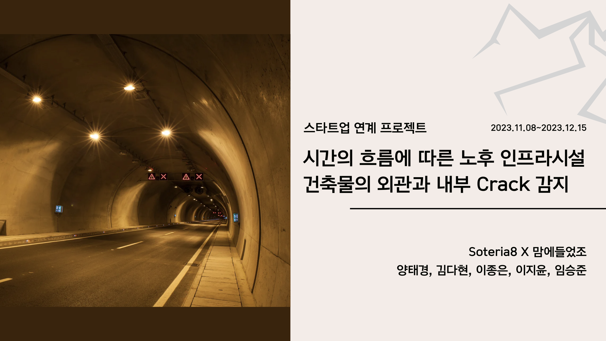
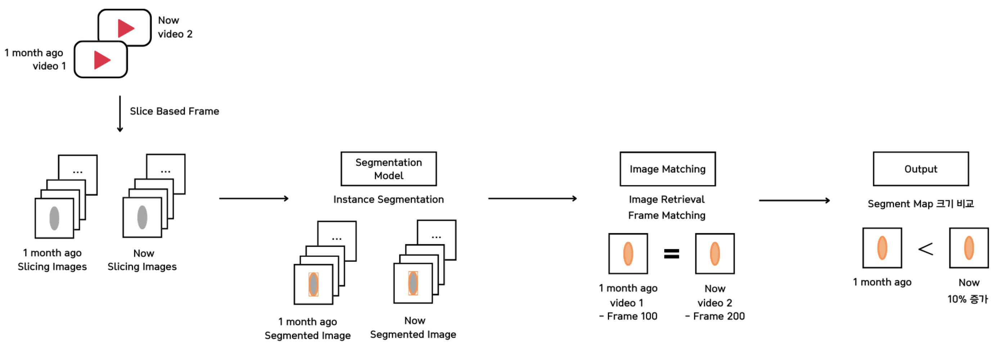
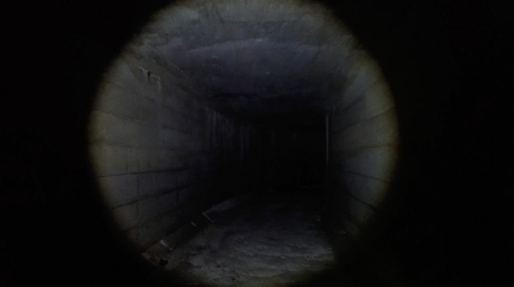
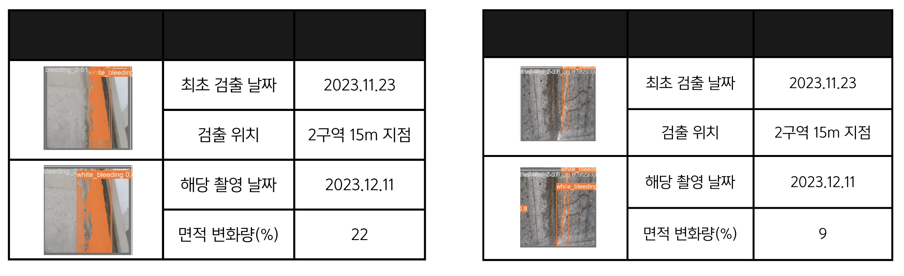
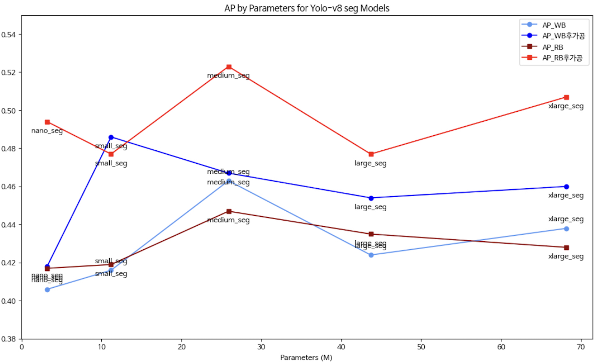

# Year-Dream School : Final_Project

<h2>📚 프로젝트 기술 스택</h2>

#### [Programming Skill] 

  
  
  
  
   

#### [IDE & Environment]

#### [Deep Learning]

#### [Team Collaboration Tool]

  

# 1. 프로젝트 개요

일본의 배수기장 시설 내부에 이상징후를 포착 및 진전 여부를 탐지하는 모델 개발

 

# 2. 프로젝트의 배경 및 기획 의도
 
배수기장 시설 내부의 콘크리트 구조물이 시간의 흐름에 따라 노후화되면서 수분 침투에 의한 철근 부식, 균열 등 안전성 관련된 이상징후들이 발생하고 있습니다. 이러한 구조물의 이상징후 관리를 위해서 터널 내로 들어가 육안 검사나 초음파 장비를 사용한 전역적 탐색을 하게 되는데 구조물 특성상 접근성이 어렵고 인력, 시간, 비용 면에서 많은 부담을 야기합니다. 이 문제를 해결하기 위해, 저희는 로보틱스 촬영 기반 컴퓨터 비전 안전 진단 솔루션(이하 '스마트 솔루션')을 제안하고 이 솔루션을 통해 구조물의 상태를 효과적으로 촬영하고 수집된 영상을 통해서 손쉽게 이상 징후를 감지함으로써, 안전 점검의 효율성을 높이고 경제적인 이점을 제공할 것으로 예상되어 프로젝트를 기획하게 되었습니다.

<!-- - 팀 프로젝트시 참여 인원 및 본인의 역할 
    - YOLO 모델 구성 및 실험진행 -->

 

# 3. 문제 해결 방식 접근 방식?

배수기장 내부를 드론을 이용해 촬영

- 1.로보틱스(드론) 이전 촬영 영상과 일정 시간이 지난 뒤의 촬영 영상(비교군)을 input으로 설정합니다.
- 2.각 영상을 frame단위로 slicing하여 segmentation model의 입력값으로 넣습니다.
- 3.탐지된 이상징후(철근노출,bleeding)현상의 frame을 matching합니다 (ImageRetrieval)
- 4.매칭된 이상징후의 면적 비교를 통해 이상징후의 진전 여부를 판단합니다.

 

# 4. 데이터 출처 및 정의

    
    

<!-- 

 -->

- 기업에서 제공해준 배수기장 내부를 드론으로 촬영한 영상 데이터
- AI허브에서 제공하는 "건물 균열 탐지 이미지" 데이터 셋중 기업에서 탐지33를 원하는 이상징후(백태누수, 철근노출)에 대한 데이터

  

  

# 5. 프로젝트 결과

- 모델의 성능

- 배포 링크

  

# 6. 프로젝트 회고

- 잘 한점

- 한계점 및 개선 방안
    - 데이터의 

  
  
  

# 직무별 포트 폴리오 포인트 (Data Scientist)
- 문제인식
- 문제를 풀기 위한 기술 적용
- 기술의 구현 수준
- 성능

# 포트폴리오란?
- 프로젝트에 대한 상세한 설명
- 업무 관련 경험을 보여주고, 설명하는 것
    - 프로젝트의 배경 및 목적 등 아래 

# 기업이 필요로 하는 부분이 내 포폴에서 잘 보여야 함 
- 문제 정의를 명확하게 함
- 비즈니스 및 사용자에 대한 이해 부족
- 어떤 문제를 해결하려고 했는가
    - 왜 이런 프로젝트를 기획하고 실행했는가?
    - 이 프로젝트는 어떤 문제를 해결할 수 있는가
- 이 문제는 왜 중요한가? 어떤 가치가 있는가
    - 해결하면 시간 및 비용을 아낄 수 있다.

<!-- 
개요 (Overview)
개요는 프로젝트나 경험의 가장 중요한 정보를 짧고 명확하게 요약합니다. 이 부분은 주로 프로젝트의 명칭, 역할, 기간, 주요 사용 기술 등을 포함합니다. 개요의 목적은 독자가 한눈에 프로젝트의 핵심을 파악할 수 있도록 하는 것입니다.

예시:
프로젝트명: GreenSpace - 도시 녹화 프로젝트
역할: 환경 설계자 및 프로젝트 매니저
기간: 2023년 1월 - 2023년 6월
사용 기술: AutoCAD, Adobe Photoshop, GIS 매핑
주요 성과: 도시 공간에 5개의 새로운 녹지 공간 설계 및 구현, 지역 사회의 환경 개선 기여

배경 (Background)
배경은 프로젝트나 경험이 시작된 이유, 목적, 도전과제, 맥락 등을 설명합니다. 이 부분은 프로젝트의 동기, 필요성, 고려된 문제점, 타겟 사용자 등에 대한 정보를 포함할 수 있습니다. 배경은 프로젝트가 어떤 상황에서 시작되었고, 왜 중요한지에 대한 깊은 이해를 제공합니다.

예시:
프로젝트명: GreenSpace - 도시 녹화 프로젝트
배경: 이 프로젝트는 도시화로 인해 감소하는 녹지 공간과 증가하는 환경 문제에 대응하기 위해 시작되었습니다. 우리 팀은 도시 내 공공 공간의 미활용 부지를 발견하고, 이를 활용하여 주민들에게 휴식과 자연을 제공하는 녹지 공간을 조성하기로 결정했습니다. 이 프로젝트는 도시의 생태계 복원, 대기 질 개선, 지역 사회의 삶의 질 향상을 목표로 합니다.
이 두 부분은 포트폴리오에서 프로젝트에 대한 전체적인 이해를 제공하는 데 중요한 역할을 합니다. 개요는 프로젝트의 핵심 요약을, 배경은 프로젝트의 출발점과 목적을 자세히 설명합니다.

 -->

